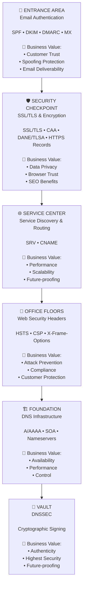
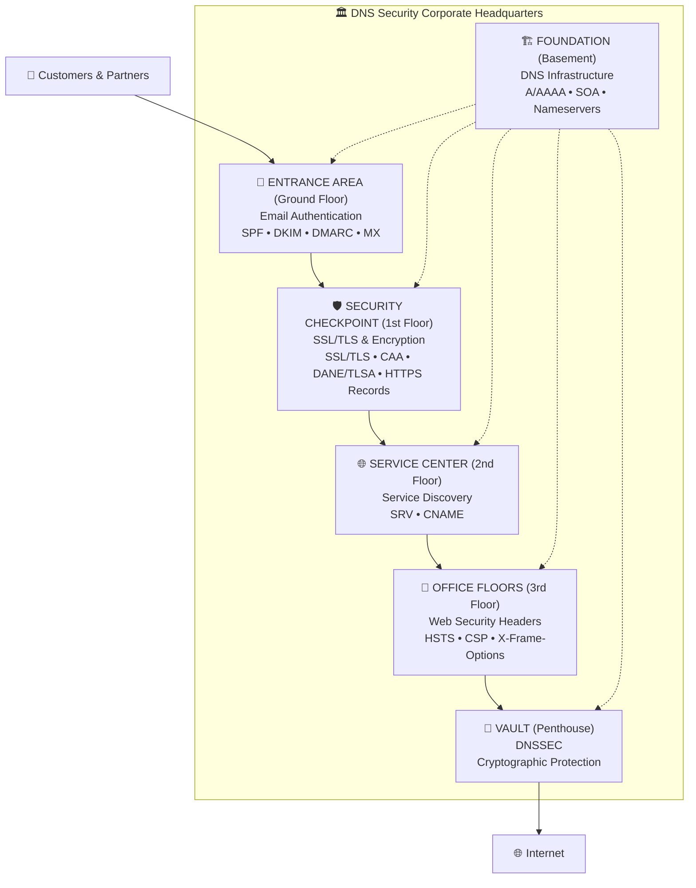

# 🏛️ The DNS Security Memory Palace

*A mental building for navigating DNS security topics*

## 🎯 Concept

Imagine a **corporate headquarters** that you walk through from outside to inside. Each area represents a critical aspect of DNS security with direct business value.

### 📊 Overview: The Security Pathway

### 🏛️ Building Cross-Section: The DNS Security Center

---

## 🚪 **Entrance Area: Email Authentication**
*"First impressions matter"*

### What happens here:
All incoming and outgoing messages are controlled and authenticated.

### Business Value:
- **🤝 Trust**: Customers know emails really come from you
- **🛡️ Protection**: No one can send fake emails in your name
- **📧 Deliverability**: Your emails don't end up in spam folders
- **📋 Compliance**: Meeting legal requirements (GDPR, etc.)

### The four gatekeepers:
- **SPF**: "Who is allowed to send emails?"
- **DKIM**: "Did the email arrive unchanged?"
- **DMARC**: "What happens when suspicious?"
- **MX**: "Where do emails arrive?"

---

## 🛡️ **Security Checkpoint: SSL/TLS & Encryption**
*"The secure passage"*

### What happens here:
All connections are encrypted, identity is authenticated, and HTTP is redirected to HTTPS.

### Business Value:
- **🔒 Data Privacy**: Customer data is protected during transmission
- **✅ Trust**: Green lock in browser creates trust
- **📈 SEO**: Google prefers HTTPS websites
- **⚖️ Compliance**: PCI-DSS and GDPR requirements met

### The security components:
- **SSL/TLS Certificates**: "Are we really who we say we are?"
- **CAA Records**: "Who is allowed to issue certificates for us?"
- **DANE/TLSA Records**: "Which certificates are anchored in DNS?" (DNS-based certificate pinning)
- **HTTPS Records**: "How does secure connection establishment work?" (HTTP→HTTPS Upgrade)

---

## 🌐 **Service Center: Service Discovery & Routing**
*"The intelligent distributor"*

### What happens here:
Services are optimally routed and modern protocols are supported.

### Business Value:
- **⚡ Performance**: Faster connections through optimal routing
- **📊 Scalability**: Intelligent load distribution
- **🚀 Future-proofing**: Support for cutting-edge protocols
- **💰 Cost Optimization**: Efficient resource utilization

### The service components:
- **SRV Records**: "Which services exist where?"
- **CNAME**: "What aliases and redirects exist?"

---

## 🏢 **Office Floors: Web Security Headers**
*"Workplace security"*

### What happens here:
Every webpage is equipped with HTTP security headers that browsers must follow.

### Business Value:
- **🚫 Attack Prevention**: Protection against XSS and clickjacking
- **📜 Compliance**: Meeting security standards
- **🏆 Reputation**: Protection from security incidents
- **👥 Customer Protection**: Browsers are informed about security policies

### The three HTTP security headers:
- **HSTS**: "Always connect encrypted" (HTTP Header)
- **CSP**: "Only load trusted content" (HTTP Header)
- **X-Frame-Options**: "Don't embed in foreign websites" (HTTP Header)

---

## 🏗️ **Foundation: DNS Infrastructure**
*"The supporting framework"*

### What happens here:
Basic DNS functionality is ensured - without this, nothing works.

### Business Value:
- **🌍 Availability**: Website is reachable at all
- **⚡ Performance**: Fast DNS resolution
- **🔄 Redundancy**: Failover protection through multiple nameservers
- **👑 Control**: Complete sovereignty over the domain

### The supporting pillars:
- **A/AAAA Records**: "Where is our website?"
- **SOA Records**: "Who is responsible and what are the timing parameters?"
- **Nameservers**: "Who answers DNS queries?"

---

## 🔐 **Vault: DNSSEC**
*"Cryptographic protection"*

### What happens here:
All DNS responses are cryptographically signed and validated. DANE connects DNS security with SSL/TLS certificates.

### Business Value:
- **🔍 Authenticity**: Protection against DNS manipulation and spoofing
- **🤝 Trust**: Customers guaranteed to reach the real website
- **🏅 Compliance**: Highest security standards met
- **🔮 Future-proofing**: Preparation for stricter security requirements
- **🔗 Certificate Pinning**: DANE/TLSA prevents fake certificates through DNS anchoring

---

## 🧭 **The Mental Walkthrough**

Mentally walk this path:

1. **🚪 Entrance** → *"Can we communicate trustworthily?"*
2. **🛡️ Security Checkpoint** → *"Are our connections secure?"*
3. **🌐 Service Center** → *"Do our services function optimally?"*
4. **🏢 Office Floors** → *"Are our websites protected?"*
5. **🏗️ Foundation** → *"Is our basic infrastructure stable?"*
6. **🔐 Vault** → *"Is everything cryptographically secured?"*

---

## 💡 **The Core Message**

*"Each area is important, but only together do they form a secure corporate headquarters. A weak area endangers the entire building. DNS security is like a house foundation - invisible but indispensable."*

### **Why this approach works:**
- **Visual**: Everyone can imagine a building
- **Logical**: The sequence follows data flow
- **Business-oriented**: Each area has clear business value
- **Memorable**: Spatial memory techniques are very effective

---

## 🎯 **Practical Application**

When explaining DNS security topics:

1. **Locate it in the building**: "We're now in the entrance area..."
2. **Explain the function**: "Here we control who can send emails..."
3. **Show business value**: "This means for your company..."
4. **Warn of consequences**: "Without this control, attackers can..."

This memory palace helps navigate through all security aspects in a structured way while always keeping business value in focus.

